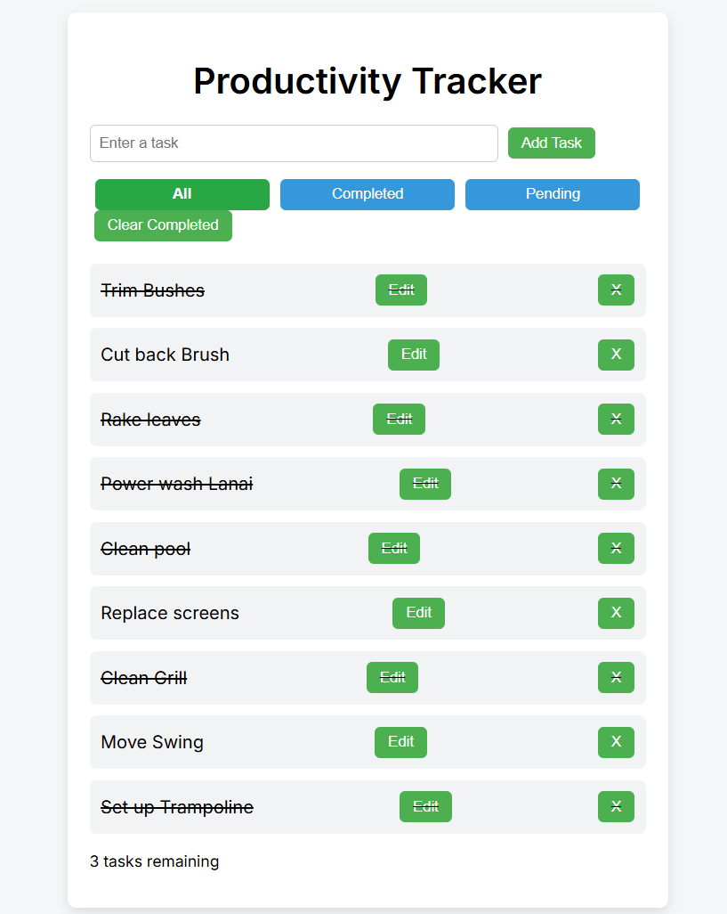

# Task Manager App

A simple productivity task manager built with HTML, CSS, and JavaScript.

## Features
- Add tasks  
- Edit tasks  
- Delete tasks  
- Mark tasks as completed  
- Filter tasks (All / Completed / Pending)  
- Clear completed tasks  
- Local storage persistence  

## What I Learned
While building this project I practiced:
- DOM manipulation  
- Event handling  
- Array methods (map, filter)  
- State-driven UI rendering  
- Local storage data storage  

## Technologies Used
- HTML
- CSS
-JavaScript

## Screenshot

## Live Demo
https://lttrotty33.github.io/task-manager-app/